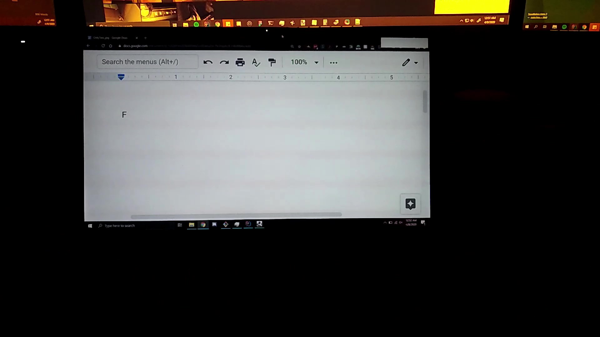
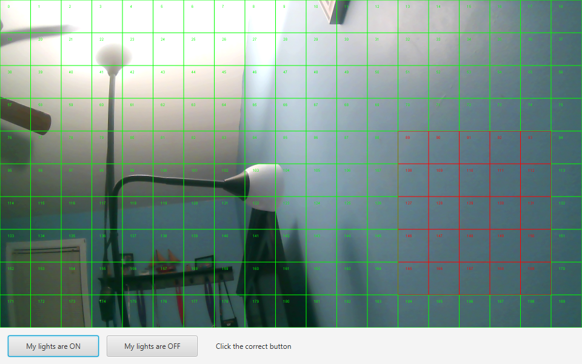

# BinaryCamera

BinaryCamera's goal is to allow the user to type in their computer using nothing but their light. The binary is typed in by turning their light on/off as ones and zeros, recorded through their webcam. Yes, this is stupid. Yes, I am bored.

This really doesn't do much, it does allow the user to select what areas of the camera should be detected, along with some shitty calibration based on your room's light levels. By default, if your lights are on for 500 milliseconds or more, it is a 1. Anything less, and it is a 0. If no light change is detected in 5 seconds, the current input is cleared.

If you either don't know binary or are incapable of googling, [here's a table](Binary.md) of ASCII values. I probably forgot some, so you'll have to touch up on one of those previously mentioned skills.

Here's a video of the thing in action.

Here's a screenshot of the calibration and cell selection:

